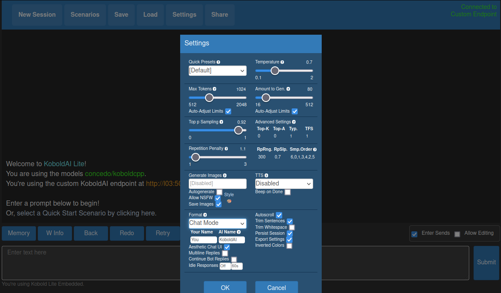

# koboldcpp-container

## Description

This project lets you evaluate a GGML model with koboldcpp on linux
with few commands.  
You need linux with `docker compose`.


## TL;DR
Clone this repo and run the start script:

```
git clone https://github.com/ludwigprager/koboldcpp-container.git
./koboldcpp-container/start.sh
```

Open this URL in a browser:
```
http://localhost:5001
```

## Ask a Question
First, go to 'Settings' and change 'Story Mode' to 'Chat Mode':
  
Then, ask your first question.

## Select a Model
By default [ggml-vicuna-7b-4bit-rev1](https://huggingface.co/eachadea/legacy-ggml-vicuna-7b-4bit) is used. To select a different model pass the URL to the start script, like:
```
./start.sh https://huggingface.co/TheBloke/LongChat-7B-GGML/resolve/main/longchat-7b-16k.ggmlv3.q2_K.bin
```
